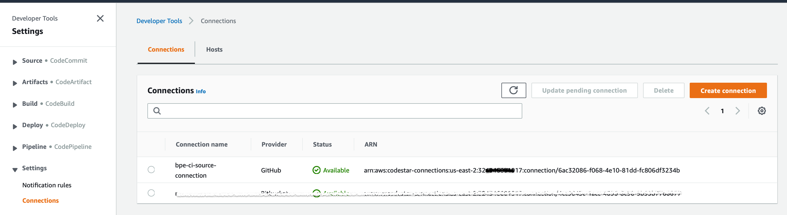
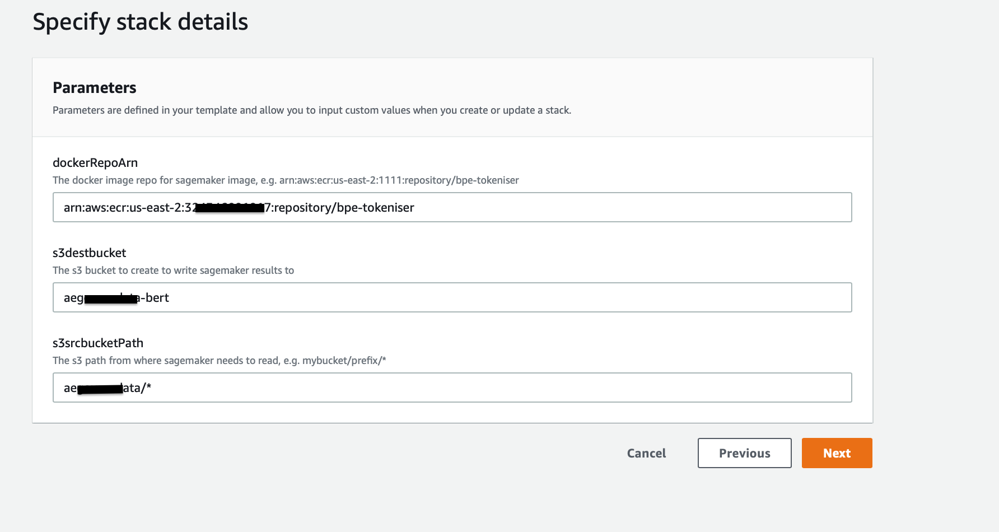
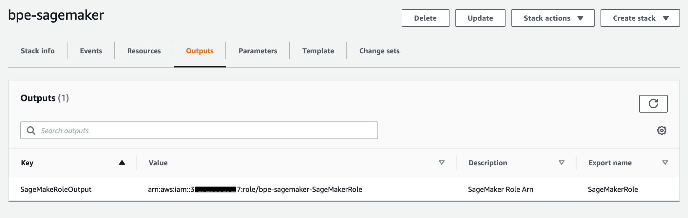

# Infrastructure on AWS 

This deploys AWS infrastructure such as 

1. S3 bucket
2. IAM policies and roles
3. AWS Codepipeline for building docker
4. Docker in AWS ECR

### Prerequisites 


## Setup 

1. Prerequisites

   - Python 3.7
   - Create virtual environment
   - AWS CDK , see https://docs.aws.amazon.com/cdk/latest/guide/work-with-cdk-python.html

1. Install requirements

    ```bash   
    pip install -r infra/src/requirements.txt   
    ```

2. Synth Cloudformation template, which will produce the output in cdk.out

    ```bash
    export PYTHON_PATH=./infra/src    
    cdk --app "python infra/src/app.py" synth
    ```

## Deploy cloudformation stacks

Here you deploy 2 stacks in `CDK.out`

#### Step 1. Continous integration stack 
    
1. Deploy the cdk.out/bpe-tokeniser-1-CI.template.json 

1. Once you deploy the Continous integration stack , enable the github connections on AWS Codepipeline
    
    
    
#### Step 2. SageMaker Stack
    
1. Deploy the cdk.out/bpe-tokeniser-2-sagemaker.template.json, this deploys the Sagemaker role and bucket.

      
     
     Make a note of the output role
     
      

